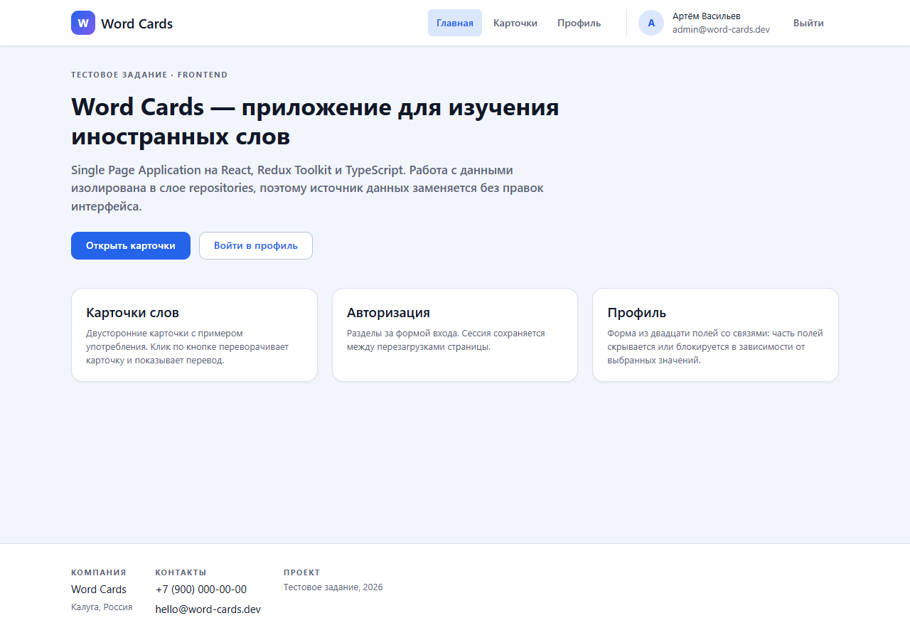
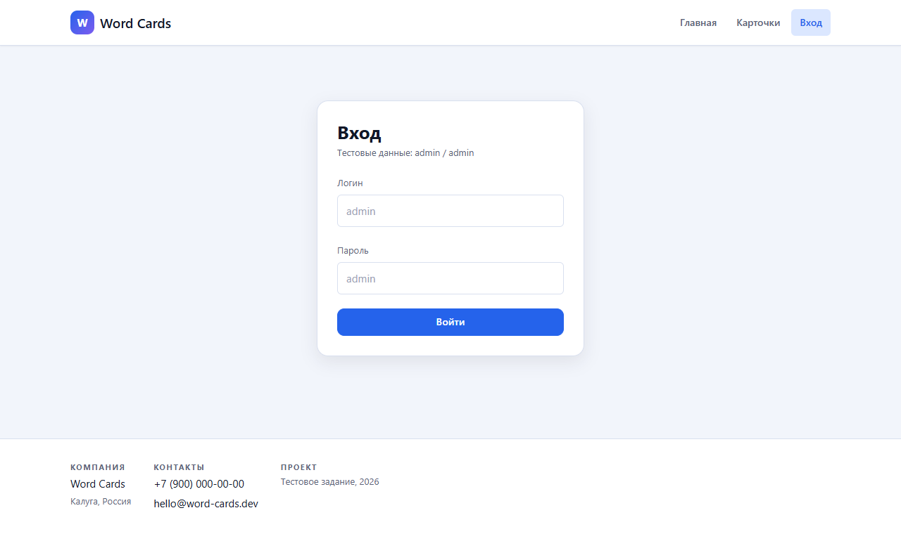
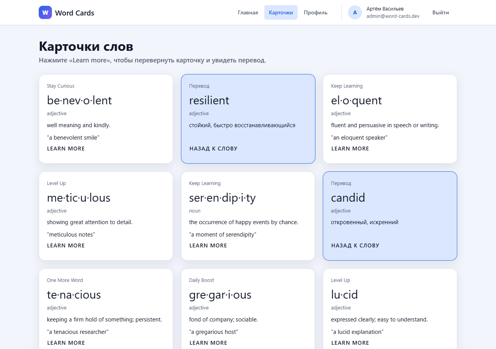
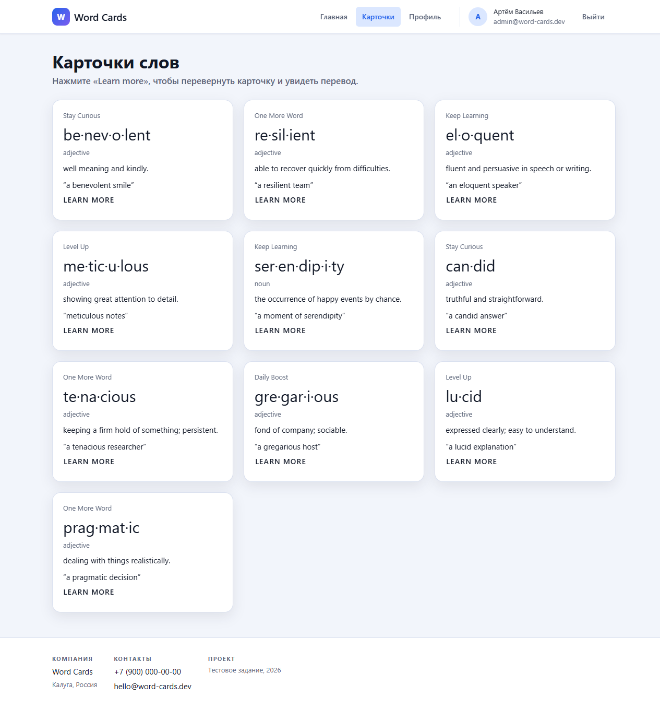
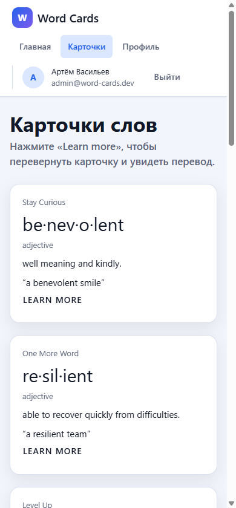
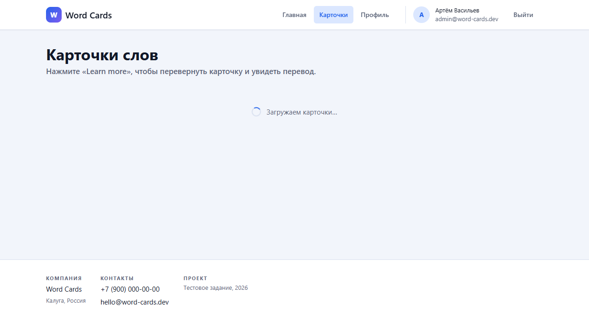
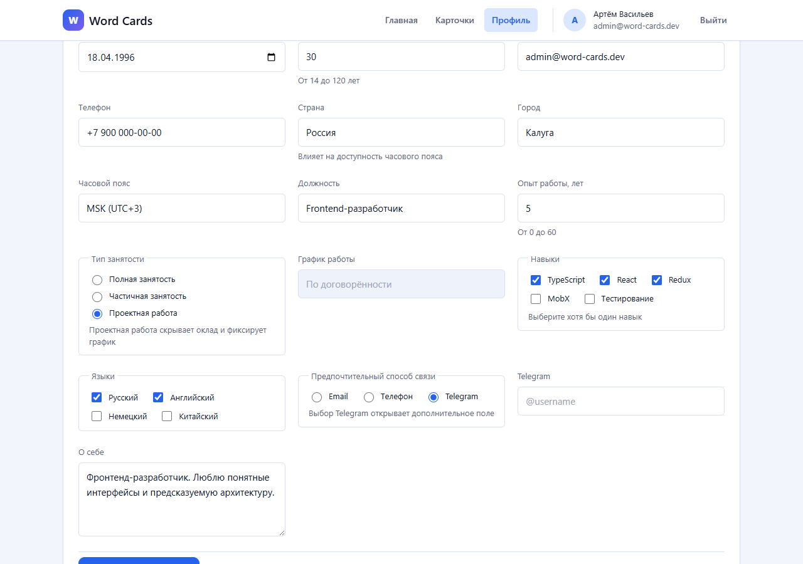
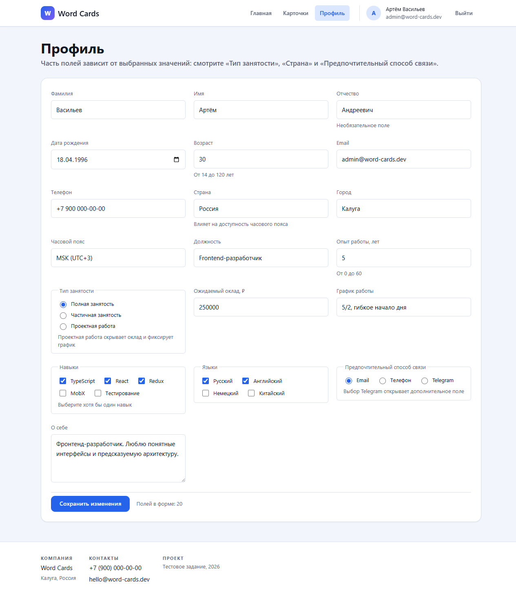

# gk-astral-interview

Тестовое задание на позицию Frontend-разработчика (ГК «Астрал»).

Single Page Application для изучения иностранных слов: карточки с переводом,
авторизация и форма редактирования профиля из двадцати полей со связями между
ними.

Демо: **https://gk-astral-interview.vercel.app** (вход `admin` / `admin`).

Ответы на теоретические вопросы задания — [docs/theory.md](docs/theory.md).

## Интерфейс

Главная рассказывает о проекте; данные для хедера и футера прокидываются через
пропсы, как требует задание.



Форма входа центрирована по середине экрана. Логин и пароль — `admin` / `admin`,
при неверных данных показывается сообщение «Вход невозможен: неправильные логин
или пароль».



Лицевая сторона карточки повторяет пример из задания: заголовок, слово по слогам,
часть речи, определение и пример употребления. Клик по `LEARN MORE`
переворачивает карточку и показывает перевод — на скриншоте две карточки
перевёрнуты.



<details>
<summary>Вся сетка карточек и мобильный вид</summary>





</details>

Пока данные грузятся, страница показывает компонент `Loader`.



В профиле двадцать полей. На скриншоте выбраны «Проектная работа» и Telegram:
оклад скрыт, график работы заблокирован со значением «По договорённости»,
появилось поле «Telegram».



<details>
<summary>Форма профиля целиком</summary>



</details>

## Стек

| Область        | Решение                                       |
| -------------- | --------------------------------------------- |
| Ядро           | React 19, TypeScript 5.8, Vite 6              |
| Состояние      | Redux Toolkit, react-redux                    |
| Роутинг        | react-router-dom 7                            |
| Стилизация     | @emotion/styled                               |
| Формы          | react-hook-form, @astral/validations          |
| Работа с сетью | axios, axios-retry                            |
| Линтер/формат  | Biome + @astral/biomejs-config                |
| Git-хуки       | husky, lint-staged, @astral/commitlint-config  |

Тулинг повторяет актуальный стек Астрала: конфигурация линтера и коммитлинта
подключена из их публичных пакетов, структура слоёв следует
[Astral Architecture Guide](https://github.com/kaluga-astral/guides).

## Запуск

```bash
npm install
npm run dev
```

Приложение поднимется на http://localhost:5173.

Учётные данные для входа: **admin / admin**.

## Скрипты

| Команда              | Назначение                                |
| -------------------- | ----------------------------------------- |
| `npm run dev`        | Дев-сервер Vite                           |
| `npm run build`      | Продакшен-сборка                          |
| `npm run preview`    | Просмотр собранной версии                 |
| `npm run lint`       | Biome: проверка и автоисправление         |
| `npm run lint:all`   | Biome, включая нестрогие диагностики      |
| `npm run lint:ci`    | Biome без автоисправления — режим для CI  |
| `npm run lint:types` | Проверка типов через `tsc --noEmit`       |
| `npm test`           | Прогон тестов Vitest                      |
| `npm run test:watch` | Тесты в режиме наблюдения                 |

Наполнение мок-сервиса данными — `node scripts/seed-mockapi.mjs <baseUrl>`,
подробнее в разделе «Мок-API».

## Что реализовано

Задание предполагает три уровня; реализован **полный** плюс продвинутый уровень
формы профиля.

| Раздел     | Маршрут    | Доступ                | Состояние |
| ---------- | ---------- | --------------------- | --------- |
| Главная    | `/`        | всем                  | готово    |
| Логин      | `/login`   | всем                  | готово    |
| Карточки   | `/cards`   | после авторизации     | готово    |
| Профиль    | `/profile` | после авторизации     | готово    |

- **Карточки.** Слова хранятся массивом, заголовок карточки выбирается случайно
  из предустановленных вариантов. Лицевая сторона повторяет пример из задания:
  заголовок, слово по слогам (`be·nev·o·lent`), часть речи, определение и пример
  употребления в кавычках, снизу — кнопка-надпись `LEARN MORE`. Клик по кнопке
  действия переворачивает карточку CSS-анимацией (`rotateY` +
  `backface-visibility`) и показывает перевод, повторный клик возвращает
  лицевую сторону.
- **Логин.** Форма центрирована, при неверных данных показывается сообщение
  «Вход невозможен: неправильные логин или пароль». Сессия сохраняется в
  localStorage, поэтому перезагрузка страницы не разлогинивает.
- **Профиль.** Двадцать полей, среди них число, строка, текст, дата,
  выпадающий список, группа checkbox-ов и radiogroup.

### Связи полей (продвинутый уровень)

| Условие                                | Эффект                                                                  |
| -------------------------------------- | ----------------------------------------------------------------------- |
| Тип занятости = «Проектная работа»      | «Ожидаемый оклад» скрывается; «График работы» блокируется со значением «По договорённости» |
| Способ связи = «Telegram»               | появляется поле «Telegram»                                              |
| Страна ≠ «Россия»                       | «Часовой пояс» блокируется со значением UTC                             |

Связи описаны декларативно в `src/modules/profile/relations.ts`, поэтому
`EditView` не содержит условий для конкретных полей.

### Доступность

- Каркас страницы собран на `header`, `nav`, `main` и `footer`, у каждой
  страницы один заголовок первого уровня.
- Подписи связаны с контролами через `label for`, группы checkbox-ов и
  radiogroup — это `fieldset` с `legend`.
- Подсказки и тексты ошибок связаны с полями через `aria-describedby`, а
  идентификаторы строятся в одном месте — `shared/ui/controls/fieldDescription`.
  При появлении ошибки поле ссылается на неё, а не на подсказку.
- Скрытая сторона карточки помечается атрибутом `inert`, поэтому её содержимое
  недоступно ни курсору, ни клавиатуре. После переворота фокус переносится на
  кнопку открывшейся стороны: иначе браузер сбрасывает его в начало документа.
- Сообщения о загрузке и результате сохранения объявляются через живые области
  (`role="status"`), ошибки — через `role="alert"`. Компонент `Loader` сам
  является живой областью, а кольцо спиннера скрыто от программ чтения экрана:
  смысл несёт текст рядом с ним.
- Анимация переворота отключается при `prefers-reduced-motion`. Спиннер в этом
  режиме останавливается и показывается ровным кольцом: глобальный сброс
  обнуляет только длительность, а бесконечное вращение нужно снимать целиком.

## Тесты

Тесты написаны на Vitest и Testing Library, запускаются в `jsdom`:
`npm test` — разовый прогон, `npm run test:watch` — режим наблюдения.
Настройка окружения лежит в секции `test` файла `vite.config.ts`, матчеры
`jest-dom` и размонтирование после каждого теста подключаются в
`vitest.setup.ts`.

Покрыт слой `shared/ui` — переиспользуемые компоненты, от которых зависят все
страницы. Тесты написаны от лица пользователя: элементы ищутся по ролям и
подписям, а не по классам и структуре разметки, поэтому вёрстку можно менять,
не переписывая тесты.

| Что проверяется                       | Тесты                                            |
| ------------------------------------- | ------------------------------------------------ |
| Выбор тега по варианту и `as`         | `Typography`                                      |
| Тип, `disabled`, ref, проброс атрибутов | `Button`, `ButtonLink`                          |
| Роли живых областей                   | `Alert`, `Loader`                                 |
| Связь подписи, подсказки и ошибки      | `FieldLayout`, `GroupFieldLayout`, `fieldDescription` |
| Контролы отдают значение, а не событие | `TextControl`, `SelectControl`, `RadioGroupControl`, `CheckboxGroupControl` |
| Каркас страницы и навигация            | `Page`, `Header`, `Footer`                        |

## CI

Проверки живут в `.github/workflows/ci.yml` и запускаются на каждый пул-реквест
в `main` и `dev`, а также на пуш в эти ветки. Три независимые задачи идут
параллельно, чтобы в списке проверок сразу было видно, что именно упало:

| Задача            | Что запускает                          |
| ----------------- | -------------------------------------- |
| «Линтер и типы»   | `npm run lint:ci`, `npm run lint:types` |
| «Тесты»           | `npm test`                              |
| «Сборка»          | `npm run build`                         |

Версия Node берётся из `.nvmrc` — она одна и для локальной разработки, и для
CI. Зависимости ставятся через `npm ci` по `package-lock.json` с кэшем npm.
Новый пуш в ветку отменяет незавершённый прогон по предыдущим коммитам.

CI не дублирует git-хуки, а страхует их: `husky` проверяет только изменённые
файлы и обходится флагом `--no-verify`, а проверки на GitHub идут по всему
проекту и обязательны.

## Деплой

Приложение размещается на Vercel: https://gk-astral-interview.vercel.app. Прод
собирается из ветки `main`: любой пуш в неё, включая слияние пул-реквеста,
запускает новый продакшен-деплой. Каждый пул-реквест дополнительно получает
собственный preview-адрес. Всё это даёт встроенная интеграция Vercel с Git,
отдельной настройки не требуется.

Настройки сборки лежат в `vercel.json` рядом с `package.json`. Ключевая строка
там — catch-all rewrite на `/index.html`: маршрутизация у приложения клиентская,
а Vercel по умолчанию ищет на диске файл по пути запроса, поэтому без правила
прямой заход на `/cards` или перезагрузка страницы отдавали бы 404.

Переменные окружения задаются в настройках проекта Vercel. Нужна одна —
`VITE_API_BASE_URL`; без неё сборка пройдёт, а приложение будет работать на
фикстурах. Всё, что начинается с `VITE_`, Vite подставляет в клиентский бандл
на этапе сборки, поэтому секретам там не место — и по той же причине в Vercel
переменная заведена с типом Config, а не Secret: секретные значения там
write-only и с публичным префиксом не сохраняются.

Vercel не смотрит на результат GitHub Actions: деплой запускается по факту
пуша. Красная сборка не попадёт в прод потому, что изменения приходят в `main`
только через пул-реквесты с обязательными проверками.

## Архитектура

Проект следует Astral Architecture Guide: зависимости направлены строго сверху
вниз, нижний слой ничего не знает о верхнем.

```
src/
├── app/        — композиция приложения: store, роутинг, оболочка страниц
├── screens/    — страницы, собирающие модули
├── modules/    — предметная область: auth, cards, profile
├── data/       — работа с данными
│   ├── repositories/ — фасад для приложения, отдаёт модели
│   └── sources/      — получение данных (HTTP, localStorage, фикстуры)
└── shared/     — переиспользуемое без привязки к предметной области
```

Слой `data` изолирует приложение от API: `sources` знают про DTO и транспорт,
`repositories` отдают наружу модели приложения. Смена мок-сервиса на реальный
бэкенд затрагивает только `sources`.

### Иерархия компонентов

Требуемая заданием иерархия сохранена, компоненты распределены по слоям:

| Компонент  | Расположение                     | Данные            |
| ---------- | -------------------------------- | ----------------- |
| `Page`     | `shared/ui/Layout`               | через пропсы      |
| `Header`   | `shared/ui/Layout`               | через пропсы      |
| `Footer`   | `shared/ui/Layout`               | через пропсы      |
| `Body`     | `shared/ui/Layout`               | children          |
| `CardList` | `modules/cards/CardList`         | массив через пропсы |
| `Card`     | `modules/cards/Card`             | через пропсы      |
| `EditView` | `modules/profile/EditView`       | схема полей       |
| `Field`    | `modules/profile/Field`          | дескриптор поля   |

## Мок-API

Данные приложения лежат во внешнем мок-сервисе [mockapi.io](https://mockapi.io).
Приложение работает и без него: если `VITE_API_BASE_URL` не задан, `data/sources`
берут локальные фикстуры с имитацией сетевой задержки. Если URL задан, но сервис
недоступен, запрос молча откатывается на те же фикстуры — интерфейс не ломается
(см. `data/sources/fixtureFallback.ts`).

### Подключение

```bash
cp .env.example .env
```

```
VITE_API_BASE_URL=https://<projectId>.mockapi.io/api/v1
```

Нужны два ресурса — столько даёт бесплатный тариф mockapi.io (1 проект,
2 ресурса):

| Ресурс  | Методы   | Содержимое                                                                  |
| ------- | -------- | --------------------------------------------------------------------------- |
| `words` | GET      | `word`, `syllables`, `partOfSpeech`, `definition`, `translation`, `example`  |
| `users` | GET, PUT | `login`, `password`, `name`, `email` и вложенный объект `profile`            |

Профиль вложен в запись пользователя, а не вынесен в отдельный ресурс — иначе
ресурсов потребовалось бы три. Идентификатор профиля равен идентификатору записи
пользователя, поэтому сохранение формы это `PUT /users/:id`. Проверка учётных
данных опирается на данные сервиса (`GET /users?login=admin`), а не на константы
внутри приложения.

Наполнить пустые ресурсы можно скриптом:

```bash
node scripts/seed-mockapi.mjs https://<projectId>.mockapi.io/api/v1
```

Скрипт идемпотентен: удаляет прежние записи и заливает десять слов и одного
пользователя с профилем из двадцати полей.

### Почему не сервисы из задания

В задании предложены mockable.io и postman-echo. На момент выполнения оба
непригодны: mockable.io не отвечает, а postman-echo перестал присылать
`Access-Control-Allow-Origin`, поэтому браузер блокирует запросы к нему из
приложения. Отсюда выбор mockapi.io.

Ещё две особенности сервиса, учтённые в коде: на пустую выборку по фильтру
mockapi отвечает `404`, и такой ответ обрабатывается как «пользователь не
найден», а не как сбой сети; числа в ответах приводятся к числам в
`profileRepository`, потому что мок-сервисы возвращают их строками.

Мок отдаёт клиенту пароль в составе записи пользователя. Так устроена любая
имитация авторизации без бэкенда — настоящая проверка пароля живёт на сервере,
которого здесь нет.

## Принятые решения

- **Redux Toolkit, а не MobX.** В задании указан стек `react+redux+typescript`,
  поэтому взят Redux Toolkit. Стоит отметить, что в
  [технологическом радаре Астрала](https://github.com/kaluga-astral/technology-radar)
  Redux и Redux Toolkit находятся в разделе `hold`, а в `adopt` — MobX вместе с
  `@astral/mobx-query`.
- **Biome вместо ESLint и Prettier.** Актуальный шаблон Астрала
  (`kaluga-astral/junior-test-form-ts`, обновлён в октябре 2025) использует
  Biome с `@astral/biomejs-config`, хотя в радаре 2024 года ещё числятся
  ESLint и Stylelint.
- **Свой резолвер для react-hook-form.** Официальный
  `@astral/validations-react-hook-form-resolver` зафиксирован на
  react-hook-form 7.49.2. Чтобы не тянуть версию двухлетней давности, связка
  сделана вручную в `shared/form/createValidationResolver.ts` — около двадцати
  строк поверх `toPlainError`.
- **Компонент `Typography`.** Правило `noRestrictedElements` из
  `@astral/biomejs-config` запрещает использовать `p`, `span` и заголовки
  напрямую, ожидая `Typography` из `@astral/ui`. Поскольку UI-KIT не
  используется, `Typography` реализован в `shared/ui` — правило остаётся
  включённым, исключение сделано только для самого компонента.
- **Реэкспорт библиотек через `shared`.** Тот же конфиг запрещает импортировать
  `react-hook-form` и `@astral/validations` напрямую в `screens` и `modules`,
  поэтому они проходят через `shared/form`.
- **Кэширование запросов вместо RTK Query.** Экраны запрашивают данные в
  эффекте при монтировании, поэтому без защиты повторные переходы между
  разделами давали бы одинаковые запросы (а в разработке их удваивает ещё и
  `StrictMode`, который монтирует компоненты дважды). Политика описана штатной
  опцией `condition` у `createAsyncThunk` и предикатом `shouldRequest`: запрос
  уходит, только если данных ещё нет или прошлая попытка не удалась. Кэш слов
  живёт всё время работы страницы, потому что слова обезличены; кэш профиля
  сбрасывается на `logout`, чтобы личные данные не пережили смену
  пользователя. RTK Query решил бы это из коробки, но потребовал бы заменить
  слой репозиториев и рукописные слайсы — для объёма этого задания цена выше
  выгоды.

## Формат коммитов

Проект использует `@astral/commitlint-config`: `type(scope): Description`.
Описание начинается с заглавной буквы, без точки в конце.

```
feat: Add card flip animation
chore(TEST-101): Update biome config
```

Доступные типы: `feat`, `bug`, `wip`, `refactor`, `doc`, `build`, `chore`,
`revert`, `style`, `test`, `major`, `story`.

## Ветки

| Ветка                     | Назначение                     |
| ------------------------- | ------------------------------ |
| `main`                    | зависимости и настройка проекта |
| `dev`                     | интеграционная ветка            |
| `feat/implementation-spa` | реализация SPA                  |
